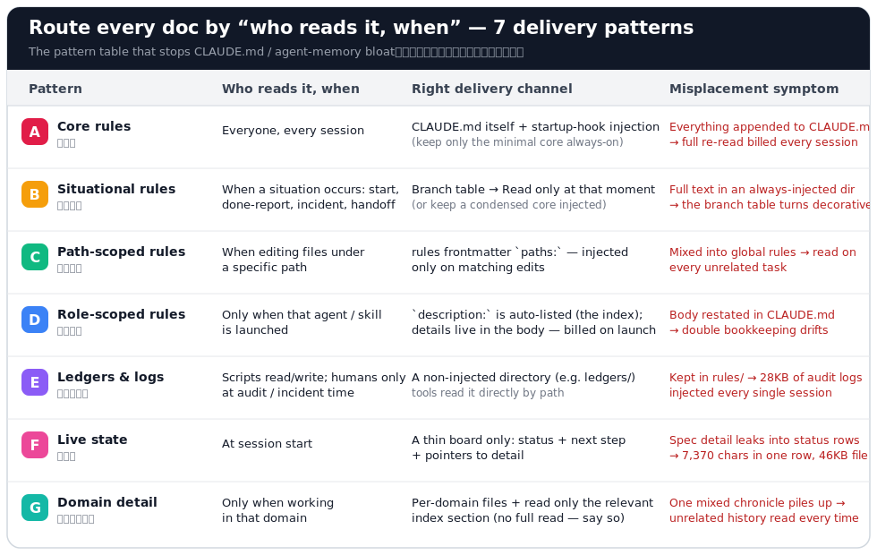

# claude-md-who-reads-when

[](https://github.com/kai-chop/claude-md-who-reads-when/actions/workflows/test.yml)

**Route every doc by “who reads it, when.”** — 7 delivery patterns (+ deterministic budget guards) that stop CLAUDE.md / agent-memory bloat.

> 🇯🇵 日本語版: [README.md](README.md)

## Is everyone reading your entire CLAUDE.md, every time?

Claude Code injects `CLAUDE.md` and `~/.claude/rules/*.md` **in full, every session**. Keep appending “just one more rule” and you end up with a structure where **you're building a voice mod but still re-reading your 3D-modeling history every day**. Measured on a real project:

- Two audit logs (humans read them only at audit time) sat in `rules/` — a **28KB injection tax per session**
- Spec details leaked into a status ledger — **7,370 chars in a single row, 46KB file**
- The session digest grew into a 53KB chronicle mixing every domain

Every one of these is the same single class of problem: **information whose reader and timing differ, piled into the same place.**

## The prescription: 7 delivery patterns (A–G)



<a id="pattern-a"></a>
### A. Core rules `#always-on`
- **Who, when**: everyone, every session
- **Delivery**: `CLAUDE.md` itself + a session-start hook. **Minimal core only** (guideline: body ≤2.5KB)
- **Misplacement symptom**: everything appended to the body → full re-read billed every session, key rules buried

<a id="pattern-b"></a>
### B. Situational rules `#on-demand`
- **Who, when**: when a situation occurs — starting work, reporting done, incident response, handoff
- **Delivery**: a branch table in CLAUDE.md (situation → file), Read only at that moment. For rules that must reach weaker models reliably, **keep a condensed core injected** (don't branch everything)
- **Misplacement symptom**: full text kept in an always-injected directory → the branch table turns decorative while the tax stays

<a id="pattern-c"></a>
### C. Path-scoped rules `#path-scoped`
- **Who, when**: when editing files under a specific path
- **Delivery**: `.claude/rules/*.md` with frontmatter `paths:` — auto-injected only on matching edits
- **Misplacement symptom**: mixed into global rules → read on every unrelated task

<a id="pattern-d"></a>
### D. Role-scoped rules `#role-scoped`
- **Who, when**: only when that agent / skill is launched
- **Delivery**: frontmatter `description:` is auto-listed (that's the index); details go in the body (billed only on launch)
- **Misplacement symptom**: body content restated in CLAUDE.md → double bookkeeping drifts (measured: 81% of two sections were verbatim duplicates). Detector: [`tools/check_md_routing.py`](tools/check_md_routing.py)

<a id="pattern-e"></a>
### E. Ledgers & logs `#zero-injection`
- **Who, when**: normally **only scripts** read/write them; humans look only at audit / incident time
- **Delivery**: a **non-injected directory** (e.g. `~/.claude/ledgers/`); tools read it directly by path
- **Misplacement symptom**: kept in `rules/` → 28KB of audit logs injected every session. Beware: **even if your injection-budget checker counts logs as “exempt,” the harness still injects them** (budget vs. reality drift)

<a id="pattern-f"></a>
### F. Live state `#session-start`
- **Who, when**: at session start
- **Delivery**: a thin board only — **status + next step + pointers to detail** (row-edit in place; no prose appends)
- **Misplacement symptom**: spec details and implementation history leak into status rows → 7,370 chars in one row. Prescription: move the originals to archive and fold the row (below)

<a id="pattern-g"></a>
### G. Domain detail `#read-narrow`
- **Who, when**: only when working in **that domain**
- **Delivery**: per-domain files + an index that says at the top: “**read the shared sections plus your domain's section only** (no full read)”
- **Misplacement symptom**: piled into one time-ordered chronicle mixing all domains → unrelated history read every time

## Two operating rules

1. **When a file bloats, don't trim — relocate the originals.** Move finished history and leaked detail to `archive/` **verbatim** (zero information loss, still greppable). Leave only state + pointers behind.
2. **Enforce budgets by machine, not by reminder.** “Be careful about bloat” always breaks eventually. Run budget guards in pre-commit (below).

## Tools (Python stdlib only, self-tests included)

### 1. `tools/check_doc_budget.py` — document budget guard

Put `doc-budget.json` at the repo root:

```json
{
  "budgets":    { "spec/STATE-LEDGER.md": 16000, "spec/SESSION-DIGEST.md": 24000 },
  "row_limits": { "spec/STATE-LEDGER.md": 600 }
}
```

```console
$ python tools/check_doc_budget.py            # 0=within budget / 1=over (prints rows + prescription)
$ python tools/check_doc_budget.py --self-test
```

Pre-commit example (checks only when the target files are staged):

```sh
if git diff --cached --name-only | grep -qE '^spec/(STATE-LEDGER|SESSION-DIGEST)\.md$'; then
  python tools/check_doc_budget.py || exit 1
fi
```

### 2. `tools/check_md_routing.py` — re-duplication (route backflow) detector

Exits 1 when `description:` content is restated verbatim in the CLAUDE.md body (pattern D backflow). Note: the verbatim-window check requires Japanese characters by default (`MIN_JP`); set `MIN_JP = 0` for English-only descriptions.

```console
$ python tools/check_md_routing.py --root .
$ python tools/check_md_routing.py --self-test
```

## Measured effect (all patterns applied to one real project)

| Target | Before | After |
|---|---|---|
| Always-injected globals (CLAUDE.md + rules/) | 47.2KB | **10.8KB (−77%)** |
| Progress ledger (read at every session start) | 46.7KB | **13.2KB (−72%)** |
| Session digest | 53.5KB | **20.9KB (−61%)** |

Not a single byte of information was discarded — originals were relocated to `archive/` and verified by exact string match.

## FAQ

- **Q. Why not make everything on-demand and inject nothing?** — Behavioral rules (B) require the model to actually perform the “Read it then” step. Keep the core that must never break injected, and take **only lookups (E) to zero injection**.
- **Q. Doesn't relocating lose history?** — The opposite. Originals go to `archive/` verbatim, so grep returns the exact row as it was. That preserves more than prose “summaries” do.
- **Q. Does this apply outside Claude Code?** — The pattern table works for any agent with an always-loaded memory file (AGENTS.md, .cursorrules, …). The tools just inspect markdown, so they port as-is.

## Tags

`claude-code` `claude-md` `context-engineering` `agent-memory` `documentation` `knowledge-management` `who-reads-when`

## License

MIT
