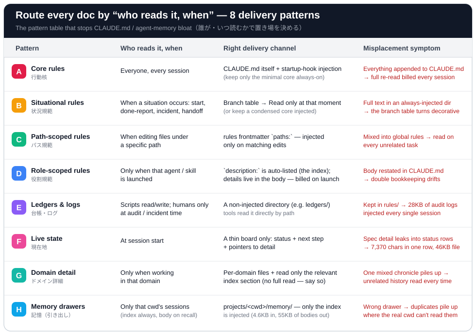

# claude-md-who-reads-when

[](https://github.com/kai-chop/claude-md-who-reads-when/actions/workflows/test.yml)

**Route every doc by “who reads it, when.”** — 8 delivery patterns, deterministic budget guards, and relocation tools that stop CLAUDE.md / agent-memory bloat.

> 🇯🇵 日本語版: [README.md](README.md)

## Is everyone reading your entire CLAUDE.md, every time?

Claude Code injects `CLAUDE.md` and `~/.claude/rules/*.md` **in full, every session**. Keep appending “just one more rule” and you end up with a structure where **you're building a voice mod but still re-reading your 3D-modeling history every day**. Measured on a real project:

- Two audit logs (humans read them only at audit time) sat in `rules/` — a **28KB injection tax per session**
- Spec details leaked into a status ledger — **7,370 chars in a single row, 46KB file**
- The session digest grew into a 53KB chronicle mixing every domain

Every one of these is the same single class of problem: **information whose reader and timing differ, piled into the same place.**

## The prescription: 8 delivery patterns (A–H)



<a id="pattern-a"></a>
### A. Core rules `#always-on`
- **Who, when**: everyone, every session
- **Delivery**: `CLAUDE.md` itself + a session-start hook. **Minimal core only** (guideline: body ≤2.5KB)
- **Misplacement symptom**: everything appended to the body → full re-read billed every session, key rules buried

<a id="pattern-b"></a>
### B. Situational rules `#on-demand`
- **Who, when**: when a situation occurs — starting work, reporting done, incident response, handoff
- **Delivery**: a branch table in CLAUDE.md (situation → file), Read only at that moment. For rules that must reach weaker models reliably, **keep a condensed core injected** (don't branch everything). The line drawn in practice: thinking / quality / workflow rules stay injected; ledgers (E) are the ones moved behind the branch table
- **Misplacement symptom**: full text kept in an always-injected directory → the branch table turns decorative while the tax stays

<a id="pattern-c"></a>
### C. Path-scoped rules `#path-scoped`
- **Who, when**: when editing files under a specific path
- **Delivery**: `.claude/rules/*.md` with frontmatter `paths:` — auto-injected only on matching edits
- **Misplacement symptom**: mixed into global rules → read on every unrelated task

<a id="pattern-d"></a>
### D. Role-scoped rules `#role-scoped`
- **Who, when**: only when that agent / skill is launched
- **Delivery**: frontmatter `description:` is auto-listed (that's the index); details go in the body (billed only on launch)
- **Misplacement symptom**: body content restated in CLAUDE.md → double bookkeeping drifts (measured: 81% of two sections were verbatim duplicates). Detector: [`tools/check_md_routing.py`](tools/check_md_routing.py)

<a id="pattern-e"></a>
### E. Ledgers & logs `#zero-injection`
- **Who, when**: normally **only scripts** read/write them; humans look only at audit / incident time
- **Delivery**: a **non-injected directory** (e.g. `~/.claude/ledgers/`); tools read it directly by path
- **Misplacement symptom**: kept in `rules/` → 28KB of audit logs injected every session. Beware: **even if your injection-budget checker counts logs as “exempt,” the harness still injects them** (budget vs. reality drift)

<a id="pattern-f"></a>
### F. Live state `#session-start`
- **Who, when**: at session start
- **Delivery**: a thin board only — **status + next step + pointers to detail** (row-edit in place; no prose appends)
- **Misplacement symptom**: spec details and implementation history leak into status rows → 7,370 chars in one row. Prescription: move the originals to archive and fold the row (below)

<a id="pattern-g"></a>
### G. Domain detail `#read-narrow`
- **Who, when**: only when working in **that domain**
- **Delivery**: per-domain files + an index that says at the top: “**read the shared sections plus your domain's section only** (no full read)”
- **Misplacement symptom**: piled into one time-ordered chronicle mixing all domains → unrelated history read every time

<a id="pattern-h"></a>
### H. Memory drawers `#indexed-recall`
- **Who, when**: **only sessions in that working directory**. The index every time; a memory's body only when recalled
- **Delivery**: `~/.claude/projects/<cwd-slug>/memory/`. Only the one-line index `MEMORY.md` is always injected; each memory's body is read when the model decides it needs it (measured: 4.6KB index injected, 55KB of bodies across 24 files not injected). **Never write something the rules already say** — keep one canonical source
- **Misplacement symptom**: **wrong drawer.** The drawer is chosen deterministically by cwd, but nothing chooses it *at save time* — it just lands in whichever session you were in. That produces ①**duplication** (copies of the same rule pile up in another drawer, dead weight in both directions) and ②**starvation** (the cwd that actually needs it can't read it) at once. Measured: 5 unrelated memories landed in one project's drawer and blew its injection budget, while another drawer held 16 duplicates of the same rules
- **Ask before saving**: “**which working directory will use this again?**” If it isn't this one, write it to that project's `memory/`

## Three operating rules

1. **When a file bloats, don't trim — relocate the originals.** Move finished history and leaked detail to `archive/` **verbatim** (zero information loss, still greppable). Leave only state + pointers behind.
2. **Enforce budgets by machine, not by reminder.** “Be careful about bloat” always breaks eventually. Run budget guards in pre-commit (below).
3. **After detection, the next thing to add is not a second detector — it's automating the relocation.** Even with per-section ratchets in place, the digest measurably **sat at 99.2% of budget**. Detection was sufficient; what was missing was that *moving* was still manual. Countermeasure strength runs **eliminate > observe > detect > remind** — reaching for a second detector on the same problem is a sign you're at the wrong layer.

## Tools (Python stdlib only, self-tests included)

### 1. `tools/check_doc_budget.py` — document budget guard

Put `doc-budget.json` at the repo root (every key shown in [`doc-budget.example.json`](doc-budget.example.json)):

```json
{
  "warn_ratio": 0.95,
  "budgets":    { "spec/STATE-LEDGER.md": 16000, "spec/SESSION-DIGEST.md": 24000 },
  "row_limits": { "spec/STATE-LEDGER.md": 600 },
  "section_rules": {
    "spec/SESSION-DIGEST.md": { "heading": "^## 20\\d\\d-", "max_sections": 4,
                                "max_section_bytes": 3000 },
    "spec/research-index.md": { "heading": "^## ", "max_section_bytes": 1000,
                                "baseline": { "4.11": 1383 } }
  }
}
```

- **`budgets` / `row_limits`** — byte budget per file, and a character cap for a single markdown table row (the tripwire for spec leakage).
- **`warn_ratio`** — early warning on **approach**, not just overflow (default 0.85). A guard that only fires on overflow still prints PASS at 96.9%, so the only way to notice is for a human to remember — i.e. it degrades back into a reminder (this happened). Set it too low and several files warn on every commit until nobody reads them, so put it **one step above where your files normally sit**.
- **`section_rules` (per-section ratchet)** — a whole-file cap alone turns into whack-a-mole (“warn → hand-trim a bit”). These stop the growth structure itself.
  - `max_sections` … cap on the **number** of dated sections — mechanically enforces “rotate as soon as it's finished,” so steady-state size is bounded by work in progress.
  - `max_section_bytes` … cap per section. A section ends at the next `## ` heading of any kind.
  - `baseline` … **freezes already-bloated sections at their current size** (allowed = max(baseline, cap)) — i.e. **growth-only ban**. To grow one, first move the detail to where it belongs, then thin the section (Strangler). Once it slims below the cap, the tool tells you to delete its baseline entry.
  - **ADR**: a hash-based rule (“touch it → you must migrate it fully”) was **rejected** — it forces doc-migration work in the middle of unrelated tasks, inviting scope creep.

```console
$ python tools/check_doc_budget.py            # 0=within budget / 1=over (prints rows + prescription)
$ python tools/check_doc_budget.py --self-test
```

Pre-commit example (checks only when the target files are staged):

```sh
if git diff --cached --name-only | grep -qE '^spec/(STATE-LEDGER|SESSION-DIGEST)\.md$'; then
  python tools/check_doc_budget.py || exit 1
fi
```

### 2. `tools/check_md_routing.py` — re-duplication (route backflow) detector

Exits 1 when `description:` content is restated verbatim in the CLAUDE.md body (pattern D backflow). Note: the verbatim-window check requires Japanese characters by default (`MIN_JP`); set `MIN_JP = 0` for English-only descriptions.

```console
$ python tools/check_md_routing.py --root .
$ python tools/check_md_routing.py --self-test
```

### 3. `tools/rotate_digest.py` / `tools/rotate_ledger.py` — automating the relocation itself

Operating rule 3, made real. **Dry-run by default**; never commits or pushes.

```console
$ python tools/rotate_digest.py                    # show what would move
$ python tools/rotate_digest.py --apply            # move finished sections to archive, verbatim
$ python tools/rotate_ledger.py --rows 51 --apply  # move the named ledger rows, verbatim
```

- **Digest (rotating sections)** — the mechanical definition of “finished” is **anything but the newest** (a dated section is closed the moment the next one opens). The heading pattern is read from `doc-budget.json`, so the rule lives in one place. It assumes sections appear **oldest-first** and does not sort by date (`heading` is an arbitrary regex — the key isn't necessarily a date). If your file is ordered newest-first, the dry-run prints **which sections would be kept**, so you can catch it before `--apply`.
- **Ledger (rotating rows)** — the same rule does *not* transfer. Rows have no “newest = live” equivalent, and a ✅ row often still carries a next step (`remaining=README`), so auto-moving by status word would **destroy the live state**. Hence two tiers: the `## Recently closed` section is governed by the ledger's own “keep it to a few rows” rule, so **keep-N is fully automatic**; everything else must be named explicitly with `--rows` (the human keeps the judgment, the machine only does the moving). LIVE rows are refused unless `--allow-live`.
- **Invariants**: (a) before deleting anything, **re-read the archive from disk** to confirm the verbatim copy landed; if a line is missing, **abort without touching the source file** (stopping beats losing data). (b) surviving lines are not modified by a single character — not even trailing-whitespace normalization.
- **Filenames carry a machine tag** (default: normalized hostname). Two machines rotating on the same day would otherwise write different content to the same path and collide add/add on pull (this happened). Making the *naming* mechanical means the collision can't occur — elimination, not detection.

## Measured effect (all patterns applied to one real project, 2026-07-17)

| Target | Before | After |
|---|---|---|
| Always-injected globals (CLAUDE.md + rules/) | 47.2KB | **10.8KB (−77%)** |
| Progress ledger (read at every session start) | 46.7KB | **13.2KB (−72%)** |
| Session digest | 53.5KB | **20.9KB (−61%)** |

Not a single byte of information was discarded — originals were relocated to `archive/` and verified by exact string match.

## Re-measured 11 days later (2026-07-28, same environment)

The interesting question isn't the cut — it's whether it **stayed** cut. Same targets, measured again:

| Target | Right after the cut | 11 days later | Budget |
|---|---|---|---|
| Always-injected globals (CLAUDE.md + rules/) | 10.8KB | 16.1KB | 25.4KB (63%) |
| Progress ledger | 13.2KB | 14.4KB | 15.6KB (92%) |
| Session digest | 20.9KB | 20.7KB | 23.4KB (88%) |
| Ledgers & logs (pattern E) | — | 87KB | **0 injected** (held) |

What this shows:

- **No backflow.** The ledger that went 46.7KB → 13.2KB is still 14.4KB eleven days later. The budget guard is doing its job.
- **But files grow to fill the budget.** 88–92% is the resting band, because a budget becomes the de facto target. So the thing to add after a total-size guard is not a tighter total — it's **per-section ratchets plus automated relocation** (operating rule 3). The digest went from sitting at 99.2% back down to 88% once rotation was actually run.
- The +5.3KB on the global side is newly added behavioral rules, and it now sits under a separate machine audit (**7KB per file / 26KB total** injection budget). One file is at 96% of its cap — which is exactly the signal that the next addition has to be condensed or branched.

## FAQ

- **Q. Why not make everything on-demand and inject nothing?** — Behavioral rules (B) require the model to actually perform the “Read it then” step. Keep the core that must never break injected, and take **only lookups (E) to zero injection**.
- **Q. Doesn't relocating lose history?** — The opposite. Originals go to `archive/` verbatim, so grep returns the exact row as it was. That preserves more than prose “summaries” do.
- **Q. Won't files just grow to fill whatever budget I set?** — Yes (88–92% above). A budget guarantees *bounded*, not *minimal*. If you want closer to minimal, tightening the total is the weaker move — **per-section caps plus rotate-on-completion** works better, because it stops the growth structure rather than the symptom.
- **Q. Does this apply outside Claude Code?** — The pattern table works for any agent with an always-loaded memory file (AGENTS.md, .cursorrules, …). The tools just inspect markdown, so they port as-is.

## Tags

`claude-code` `claude-md` `context-engineering` `agent-memory` `documentation` `knowledge-management` `who-reads-when`

## License

MIT
