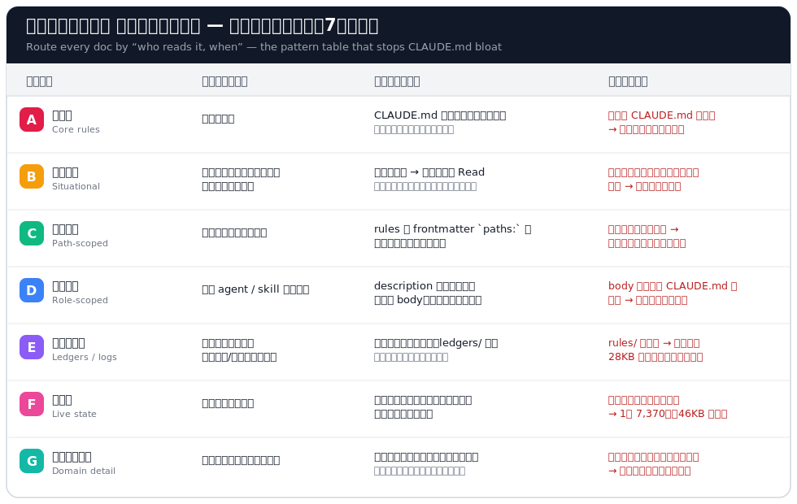

# claude-md-who-reads-when

[](https://github.com/kai-chop/claude-md-who-reads-when/actions/workflows/test.yml)

**「誰が・いつ読むか」でドキュメントの置き場を決める** — CLAUDE.md / エージェントメモリの肥大を止める7つの配達パターンと、再肥大を機械でブロックする予算ガード。

> **EN**: Route every doc by *“who reads it, when.”* A pattern language (+ deterministic budget guards) that stops CLAUDE.md / agent-memory bloat. Measured result: **47KB → 10.8KB (−77%)** injected per session. Japanese README; tools are language-agnostic (Python stdlib only).

## その CLAUDE.md、全員が毎回全部読んでいませんか

Claude Code は `CLAUDE.md` と `~/.claude/rules/*.md` を**毎セッション全文注入**します。つまり「とりあえずルールに追記」を続けると、**voice modを作っている日も3D制作の実績を読まされる**構造になります。実測では:

- 監査ログ2本（人は監査時しか読まない）が rules/ に居て **28KB/セッションの注入税**
- 進行台帳の状態行に仕様詳細が漏出して **1行7,370字・ファイル46KB**
- セッション開始時に読むダイジェストが全ドメイン混在の時系列で **53KB**

原因はどれも同じ一つのクラス: **「読者とタイミングが違う情報を、同じ置き場に積んでいる」**。

## 処方: 配達パターン表（A〜G）



<a id="pattern-a"></a>
### A. 行動核 — Core rules `#always-on`
- **誰が・いつ**: 全員・毎回
- **配達**: `CLAUDE.md` 本体＋SessionStartフック注入。**最小核だけ**（目安: 本体≤2.5KB）
- **誤配置の症状**: 何でも本体に追記 → 毎セッション全文課金・重要規範が埋没

<a id="pattern-b"></a>
### B. 状況規範 — Situational rules `#on-demand`
- **誰が・いつ**: 実装着手・完了報告・障害対応・引き継ぎなど、**状況が発生した時**
- **配達**: CLAUDE.md に分岐参照表（状況→ファイル）を置き、その時だけ Read。弱いモデルにも確実に届けたい行動規範は**凝縮して注入に残す**判断もある（全部を分岐化しない）
- **誤配置の症状**: 全文を常時注入ディレクトリに置く → 分岐表が形骸化し注入税だけ残る

<a id="pattern-c"></a>
### C. パス規範 — Path-scoped rules `#path-scoped`
- **誰が・いつ**: 特定パスのファイルを編集する時
- **配達**: `.claude/rules/*.md` の frontmatter `paths:` で該当編集時のみ自動注入
- **誤配置の症状**: 全域ルールに混ぜる → 無関係な作業でも毎回読む

<a id="pattern-d"></a>
### D. 役割規範 — Role-scoped rules `#role-scoped`
- **誰が・いつ**: その agent / skill が起動された時だけ
- **配達**: frontmatter `description:` は自動列挙される（=索引）。詳細は body に書く（起動時のみ課金）
- **誤配置の症状**: body の内容を CLAUDE.md に再掲 → 二重管理でズレる（実測: 対象節の81%が重複していた例）。検知は [`tools/check_md_routing.py`](tools/check_md_routing.py)

<a id="pattern-e"></a>
### E. 台帳・ログ — Ledgers & logs `#zero-injection`
- **誰が・いつ**: 普段は**スクリプトだけ**が読み書きし、人は監査・障害対応の時だけ
- **配達**: **注入されないディレクトリ**（例: `~/.claude/ledgers/`）に置き、ツールがパスで直接読む
- **誤配置の症状**: rules/ に置く → 監査ログ28KBが毎セッション注入される。**注入予算の検査がログを「対象外」と数えていても、ハーネスは注入する**（予算と現実のズレに注意）

<a id="pattern-f"></a>
### F. 現在地 — Live state `#session-start`
- **誰が・いつ**: セッション開始時
- **配達**: 薄い盤面だけ＝**状態＋次の一手＋詳細へのポインタ**（行単位で上書き。散文で追記しない）
- **誤配置の症状**: 状態行に仕様詳細・実装経緯が漏出 → 1行7,370字。処方は「原文をarchiveへ移送して行を畳む」（下記）

<a id="pattern-g"></a>
### G. ドメイン詳細 — Domain detail `#read-narrow`
- **誰が・いつ**: **その領域**に着手する時のみ
- **配達**: 領域別ファイル＋索引。索引の冒頭に「**共通節＋自分のドメインの節だけ読む**（全文読み禁止）」を明記
- **誤配置の症状**: 時系列ダイジェストに全ドメイン混在で堆積 → 無関係な過去も毎回読む

## 運用ルール2つ

1. **肥大したら「削る」のではなく「原文ごと移送する」** — 完結した経緯・漏出した詳細は `archive/` へ**丸ごと**移す（情報ロスゼロ・あとから grep できる）。元ファイルには状態とポインタだけ残す。
2. **予算は注意書きにせず機械でブロックする** — 「肥大に注意」はいつか必ず破れる。pre-commit で予算ガードを回す（下記）。

## ツール（Python 標準ライブラリのみ・自己テスト同梱）

### 1. `tools/check_doc_budget.py` — 文書予算ガード

リポ直下に `doc-budget.json` を置く:

```json
{
  "budgets":    { "spec/STATE-LEDGER.md": 16000, "spec/SESSION-DIGEST.md": 24000 },
  "row_limits": { "spec/STATE-LEDGER.md": 600 }
}
```

```console
$ python tools/check_doc_budget.py            # 0=予算内 / 1=超過（超過行と処方を表示）
$ python tools/check_doc_budget.py --self-test
```

pre-commit 組込例（対象ファイルが staged の時だけ検査）:

```sh
if git diff --cached --name-only | grep -qE '^spec/(STATE-LEDGER|SESSION-DIGEST)\.md$'; then
  python tools/check_doc_budget.py || exit 1
fi
```

### 2. `tools/check_md_routing.py` — 再重複（ルート逆流）検知

`description:` の内容が CLAUDE.md 本文へ逐語再掲されたら exit 1（パターンDの逆流検知）。

```console
$ python tools/check_md_routing.py --root .
$ python tools/check_md_routing.py --self-test
```

## 実測効果（このパターンを1プロジェクトに全適用した結果）

| 対象 | 前 | 後 |
|---|---|---|
| グローバル常時注入（CLAUDE.md＋rules/） | 47.2KB | **10.8KB（−77%）** |
| 進行台帳（毎セッション開始時に読む） | 46.7KB | **13.2KB（−72%）** |
| セッションダイジェスト | 53.5KB | **20.9KB（−61%）** |

情報は1バイトも捨てていません（原文は全て archive/ に移送・スクリプトで完全一致を突合）。

## FAQ

- **Q. 全部オンデマンド化すれば注入ゼロでは?** — 行動規範（B）は「その時 Read」をモデルが守れる前提が要る。弱いモデルでも破れない核は注入に残し、**lookup（E）だけを注入ゼロに**するのがバランス。
- **Q. 移送すると経緯が追えなくなる?** — 逆。原文ごと archive/ に置くので grep で当時の行がそのまま出る。散文の要約で「圧縮」するより保全性が高い。
- **Q. Claude Code 以外でも使える?** — パターン表は「常時読み込まれるメモリ」を持つエージェント全般（AGENTS.md / .cursorrules 等）に同型で効く。ツールの検査対象はただのmdなので流用可。

## タグ

`claude-code` `claude-md` `context-engineering` `agent-memory` `documentation` `knowledge-management` `who-reads-when`

## License

MIT
