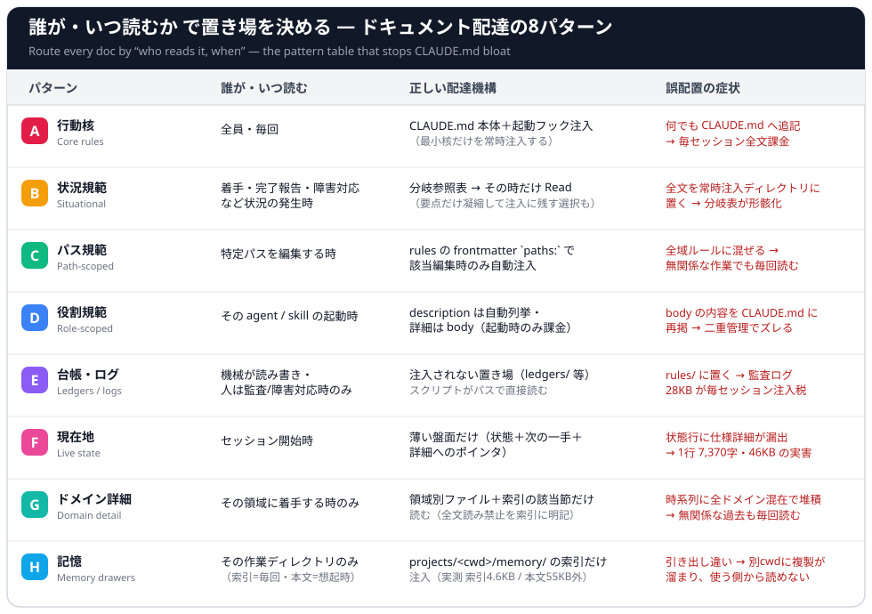

# claude-md-who-reads-when

[](https://github.com/kai-chop/claude-md-who-reads-when/actions/workflows/test.yml)

**「誰が・いつ読むか」でドキュメントの置き場を決める** — CLAUDE.md / エージェントメモリの肥大を止める8つの配達パターンと、再肥大を機械でブロックする予算ガード＋移送ツール。

> 🇬🇧 **English**: [README.en.md](README.en.md) — Route every doc by *“who reads it, when.”* Measured result: **47KB → 10.8KB (−77%)** injected per session.

## その CLAUDE.md、全員が毎回全部読んでいませんか

Claude Code は `CLAUDE.md` と `~/.claude/rules/*.md` を**毎セッション全文注入**します。つまり「とりあえずルールに追記」を続けると、**voice modを作っている日も3D制作の実績を読まされる**構造になります。実測では:

- 監査ログ2本（人は監査時しか読まない）が rules/ に居て **28KB/セッションの注入税**
- 進行台帳の状態行に仕様詳細が漏出して **1行7,370字・ファイル46KB**
- セッション開始時に読むダイジェストが全ドメイン混在の時系列で **53KB**

原因はどれも同じ一つのクラス: **「読者とタイミングが違う情報を、同じ置き場に積んでいる」**。

## 処方: 配達パターン表（A〜H）



<a id="pattern-a"></a>
### A. 行動核 — Core rules `#always-on`
- **誰が・いつ**: 全員・毎回
- **配達**: `CLAUDE.md` 本体＋SessionStartフック注入。**最小核だけ**（目安: 本体≤2.5KB）
- **誤配置の症状**: 何でも本体に追記 → 毎セッション全文課金・重要規範が埋没

<a id="pattern-b"></a>
### B. 状況規範 — Situational rules `#on-demand`
- **誰が・いつ**: 実装着手・完了報告・障害対応・引き継ぎなど、**状況が発生した時**
- **配達**: CLAUDE.md に分岐参照表（状況→ファイル）を置き、その時だけ Read。弱いモデルにも確実に届けたい行動規範は**凝縮して注入に残す**判断もある（全部を分岐化しない）。実運用の線引き＝思考・品質・段取りの規範は注入維持／台帳系（下記E）だけ分岐
- **誤配置の症状**: 全文を常時注入ディレクトリに置く → 分岐表が形骸化し注入税だけ残る

<a id="pattern-c"></a>
### C. パス規範 — Path-scoped rules `#path-scoped`
- **誰が・いつ**: 特定パスのファイルを編集する時
- **配達**: `.claude/rules/*.md` の frontmatter `paths:` で該当編集時のみ自動注入
- **誤配置の症状**: 全域ルールに混ぜる → 無関係な作業でも毎回読む

<a id="pattern-d"></a>
### D. 役割規範 — Role-scoped rules `#role-scoped`
- **誰が・いつ**: その agent / skill が起動された時だけ
- **配達**: frontmatter `description:` は自動列挙される（=索引）。詳細は body に書く（起動時のみ課金）
- **誤配置の症状**: body の内容を CLAUDE.md に再掲 → 二重管理でズレる（実測: 対象節の81%が重複していた例）。検知は [`tools/check_md_routing.py`](tools/check_md_routing.py)

<a id="pattern-e"></a>
### E. 台帳・ログ — Ledgers & logs `#zero-injection`
- **誰が・いつ**: 普段は**スクリプトだけ**が読み書きし、人は監査・障害対応の時だけ
- **配達**: **注入されないディレクトリ**（例: `~/.claude/ledgers/`）に置き、ツールがパスで直接読む
- **誤配置の症状**: rules/ に置く → 監査ログ28KBが毎セッション注入される。**注入予算の検査がログを「対象外」と数えていても、ハーネスは注入する**（予算と現実のズレに注意）

<a id="pattern-f"></a>
### F. 現在地 — Live state `#session-start`
- **誰が・いつ**: セッション開始時
- **配達**: 薄い盤面だけ＝**状態＋次の一手＋詳細へのポインタ**（行単位で上書き。散文で追記しない）
- **誤配置の症状**: 状態行に仕様詳細・実装経緯が漏出 → 1行7,370字。処方は「原文をarchiveへ移送して行を畳む」（下記）

<a id="pattern-g"></a>
### G. ドメイン詳細 — Domain detail `#read-narrow`
- **誰が・いつ**: **その領域**に着手する時のみ
- **配達**: 領域別ファイル＋索引。索引の冒頭に「**共通節＋自分のドメインの節だけ読む**（全文読み禁止）」を明記
- **誤配置の症状**: 時系列ダイジェストに全ドメイン混在で堆積 → 無関係な過去も毎回読む

<a id="pattern-h"></a>
### H. 記憶（引き出し） — Memory drawers `#indexed-recall`
- **誰が・いつ**: **その作業ディレクトリのセッションだけ**。索引は毎回・本文は想起された時だけ
- **配達**: `~/.claude/projects/<cwd-slug>/memory/`。1行索引の `MEMORY.md` **だけ**が常時注入され、各記憶の本文はモデルが必要と判断した時に読まれる（実測: 索引 4.6KB が注入・本文 55KB / 24件は注入外）。**規約（CLAUDE.md / rules）に既に書いてある事は記憶に書かない**＝正典を1つに保つ
- **誤配置の症状**: **引き出し違い**。引き出しは cwd で決定論的に決まるが、**保存時に選んでいない**＝そのセッションの引き出しへ落ちるだけ。結果、①**重複**（同じ規約の複製が別の引き出しに溜まる＝両方向で死荷重）と②**矮小化**（実際に使う cwd から読めない）が同時に起きる。実測=あるプロジェクトの引き出しに無関係な5件が混入して注入予算を超過、別の引き出しには同じ規約が16件複製されていた
- **保存前の1問**: 「これを**再び使うのはどの作業ディレクトリか**」。違うなら、そのプロジェクトの `memory/` へ書く

## 運用ルール3つ

1. **肥大したら「削る」のではなく「原文ごと移送する」** — 完結した経緯・漏出した詳細は `archive/` へ**丸ごと**移す（情報ロスゼロ・あとから grep できる）。元ファイルには状態とポインタだけ残す。
2. **予算は注意書きにせず機械でブロックする** — 「肥大に注意」はいつか必ず破れる。pre-commit で予算ガードを回す（下記）。
3. **検出の次に足すのは「2本目の検知器」ではなく「移送の機械化」** — 節単位ratchetまで入れても、実測でダイジェストは**予算の99.2%に常駐し続けた**。検出は足りていた／欠けていたのは**移送が手作業**だったこと。対策の強度は **排除＞観測＞検出＞注意** の順で、同じ問題系に検知器を2本目を足したくなったら層違いのサイン。

## ツール（Python 標準ライブラリのみ・自己テスト同梱）

### 1. `tools/check_doc_budget.py` — 文書予算ガード

リポ直下に `doc-budget.json` を置く（全キーの実例＝[`doc-budget.example.json`](doc-budget.example.json)）:

```json
{
  "warn_ratio": 0.95,
  "budgets":    { "spec/STATE-LEDGER.md": 16000, "spec/SESSION-DIGEST.md": 24000 },
  "row_limits": { "spec/STATE-LEDGER.md": 600 },
  "section_rules": {
    "spec/SESSION-DIGEST.md": { "heading": "^## 20\\d\\d-", "max_sections": 4,
                                "max_section_bytes": 3000 },
    "spec/research-index.md": { "heading": "^## ", "max_section_bytes": 1000,
                                "baseline": { "4.11": 1383 } }
  }
}
```

- **`budgets` / `row_limits`** — ファイルのバイト予算と、mdテーブル1行の字数上限（仕様漏出の防止線）。
- **`warn_ratio`** — 予算への**接近**で鳴らす早期警告（既定 0.85）。超過でしか鳴らないガードは、96.9%でも表示が PASS のままで「気づけるのは人が思い出した時だけ」＝結局は注意頼みになる（実測でそうなった）。逆に閾値が低すぎると毎コミット複数件が鳴って読まれなくなるので、**常駐帯より一歩上**に置く。
- **`section_rules`（節単位ratchet）** — ファイル総量ガードだけでは「警告→手動で少し削る」のもぐら叩きになる。そこで成長構造そのものを止める。
  - `max_sections` … 日付節の**個数**上限。完結したら即ローテする運用を機械強制する＝定常サイズが進行中WIPで有界になる。
  - `max_section_bytes` … 1節の上限。節の終端は「次の任意の `## ` 行」。
  - `baseline` … 既に肥大した節の**現サイズを凍結**（許容 = max(baseline, 上限)）＝**増加のみ禁止**。太らせたい時は詳細を本来の置き場へ移してから薄くする（Strangler）。痩せたらツールが「baseline行を削除可」と助言する。
  - **ADR**: 「触れたら即全面移送」を強制する hash 基準は**棄却**した — 無関係なタスクの最中にmd移送を強制し「ついで作業」を誘発するため。

```console
$ python tools/check_doc_budget.py            # 0=予算内 / 1=超過（超過行と処方を表示）
$ python tools/check_doc_budget.py --self-test
```

pre-commit 組込例（対象ファイルが staged の時だけ検査）:

```sh
if git diff --cached --name-only | grep -qE '^spec/(STATE-LEDGER|SESSION-DIGEST)\.md$'; then
  python tools/check_doc_budget.py || exit 1
fi
```

### 2. `tools/check_md_routing.py` — 再重複（ルート逆流）検知

`description:` の内容が CLAUDE.md 本文へ逐語再掲されたら exit 1（パターンDの逆流検知）。

```console
$ python tools/check_md_routing.py --root .
$ python tools/check_md_routing.py --self-test
```

### 3. `tools/rotate_digest.py` / `tools/rotate_ledger.py` — 移送そのものの機械化

運用ルール3の実体。**既定は dry-run**、自動 commit / push はしない。

```console
$ python tools/rotate_digest.py                    # 何が動くかだけ表示
$ python tools/rotate_digest.py --apply            # 完結した節を archive へ逐語移送
$ python tools/rotate_ledger.py --rows 51 --apply  # 台帳の指定行を逐語移送
```

- **digest（節の回転）** — 「完結した節」の機械的定義＝**最新以外**（次の日付節が始まった時点で前は完結）。見出し規則は `doc-budget.json` から読む＝2箇所に書かない。前提は「節が**古い→新しいの順に並ぶ**」ことで、日付ソートはしない（`heading` は任意の正規表現＝日付とは限らないため）。逆順に並べる運用でも dry-run が**残す節**を表示するので `--apply` の前に判定できる。
- **台帳（行の回転）** — 同じ規則は使えない。「最新以外＝完結」に相当する規則が行には無く、✅の行が「残=README」のような**次の一手**を抱えているため、状態語での自動移送は**現在地の破壊**になる。よって2段構え: `## 直近クローズ` 節は台帳自身が「数行で維持」と規定しているので **keep-N で全自動**、それ以外は `--rows` で**行番号を明示**（判断は人・移送だけ機械）。LIVE行は `--allow-live` が無い限り拒否。
- **不変条件**: (a) 消す前に archive を**読み直して**逐語保存を確認し、欠けていたら**元ファイルを一切書き換えずに中止**する（データが消えるより止まる）。(b) 残る行は1文字も触らない（末尾空白の正規化すらしない）。
- **ファイル名に機械タグ**（既定=ホスト名を正規化）を必ず付ける。2台が同日にローテすると無印名は同一パスへ別内容を作り、pull で add/add 衝突になる（実発生）。命名を機械化すれば衝突自体が起こらない＝検出でなく排除。

## 実測効果（このパターンを1プロジェクトに全適用した結果・2026-07-17）

| 対象 | 前 | 後 |
|---|---|---|
| グローバル常時注入（CLAUDE.md＋rules/） | 47.2KB | **10.8KB（−77%）** |
| 進行台帳（毎セッション開始時に読む） | 46.7KB | **13.2KB（−72%）** |
| セッションダイジェスト | 53.5KB | **20.9KB（−61%）** |

情報は1バイトも捨てていません（原文は全て archive/ に移送・スクリプトで完全一致を突合）。

## 11日後の再測定（2026-07-28・同じ環境を実測）

減量そのものより「**戻らなかったか**」が本題なので、同じ対象を測り直しました。

| 対象 | 減量直後 | 11日後 | 予算 |
|---|---|---|---|
| グローバル常時注入（CLAUDE.md＋rules/） | 10.8KB | 16.1KB | 25.4KB（63%） |
| 進行台帳 | 13.2KB | 14.4KB | 15.6KB（92%） |
| セッションダイジェスト | 20.9KB | 20.7KB | 23.4KB（88%） |
| 台帳・ログ（パターンE） | — | 87KB | **注入0**（維持） |

読み取れること:

- **逆流は起きていない**（46.7KB→13.2KB の台帳が11日後も14.4KB）。予算ガードは効いている。
- ただし**予算いっぱいまで太る**。88〜92%が常駐帯で、これは「予算＝実質の目標値」になるため。だから総量ガードの次に要るのは、より厳しい総量ではなく**節単位ratchet＋移送の機械化**（運用ルール3）。実際ダイジェストは99.2%常駐からローテ実行で88%へ戻った。
- グローバル側の +5.3KB は行動規範の追加によるもので、**個別ファイル7KB／合計26KBの注入予算**を別途機械監査に載せている（1本が96%まで来ているので、次の追記は凝縮か分岐が必要という状態が可視化されている）。

## FAQ

- **Q. 全部オンデマンド化すれば注入ゼロでは?** — 行動規範（B）は「その時 Read」をモデルが守れる前提が要る。弱いモデルでも破れない核は注入に残し、**lookup（E）だけを注入ゼロに**するのがバランス。
- **Q. 移送すると経緯が追えなくなる?** — 逆。原文ごと archive/ に置くので grep で当時の行がそのまま出る。散文の要約で「圧縮」するより保全性が高い。
- **Q. 予算を決めると予算いっぱいまで太るのでは?** — 太ります（上記の再測定で88〜92%）。予算が守るのは「際限なく太らないこと」であって「最小であること」ではない。最小に近づけたいなら、総量の予算を締めるより**節単位の上限＋完結即ローテの自動化**の方が効く（成長の構造を止めるため）。
- **Q. Claude Code 以外でも使える?** — パターン表は「常時読み込まれるメモリ」を持つエージェント全般（AGENTS.md / .cursorrules 等）に同型で効く。ツールの検査対象はただのmdなので流用可。

## タグ

`claude-code` `claude-md` `context-engineering` `agent-memory` `documentation` `knowledge-management` `who-reads-when`

## License

MIT
